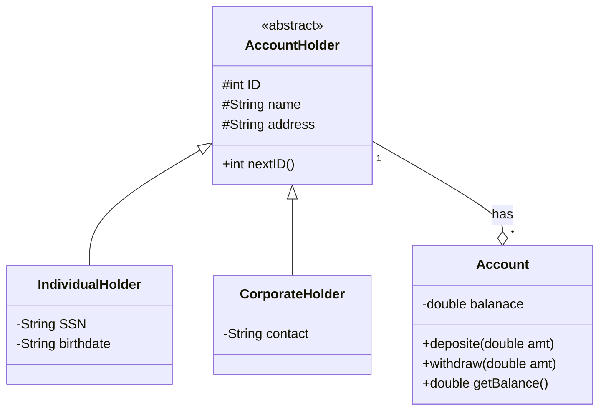
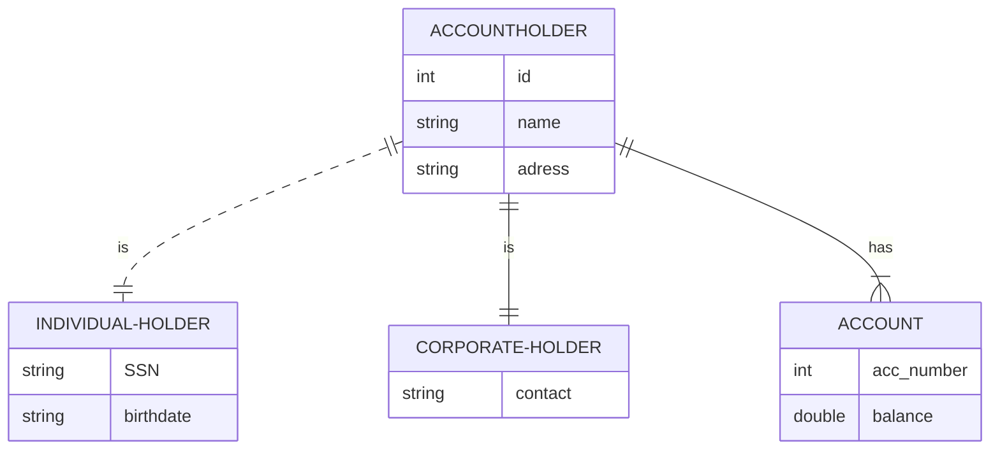

# Account Holder System
> Sistem dapat digunakan untuk transaksi perekaman data pemegang akun di bank, dimana terdapat 2 jenis akun yaitu individual dan corporate.
> Setiap Pemegang Akun dapat memiliki 1 atau lebih  akun.
> 
## Desain
### Class Diagram

### ER Diagram

